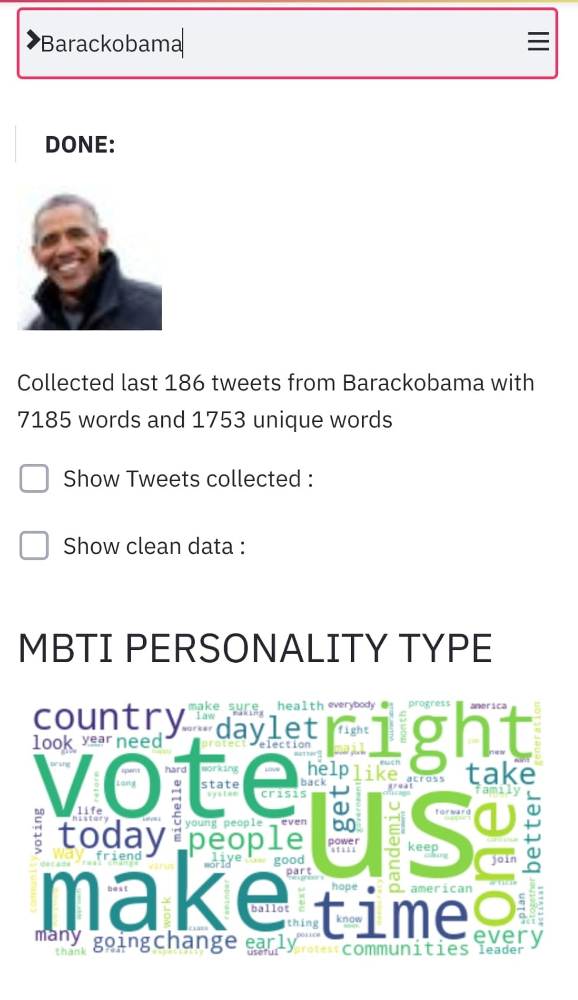

# NLP for personality Prediction (MBTI) 

TFM K-School by William Sanz Vivanco

##  Streamlit app:

> https://tfm-kschool-williamsanz.herokuapp.com/

### Citation: 

- Verhoeven, B., Daelemans, W., & Plank, B. (2016) *TwiSty: a multilingual Twitter Stylometry corpus for gender and personality profiling*. In: Proceedings of the 10th International Conference on Language Resources and Evaluation (LREC 2016). Portorož, Slovenia.
- Gjurkovi\'c, M., & \vSnajder, J. (2018). Reddit: A Gold Mine for Personality Prediction. In *Proceedings of the Second Workshop on Computational Modeling of People’s Opinions, Personality, and Emotions in Social Media* (pp. 87–97). Association for Computational Linguistics.

