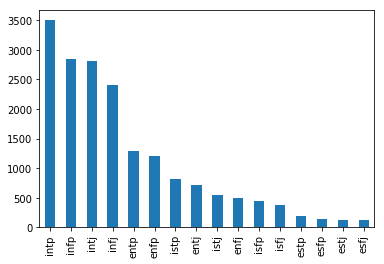
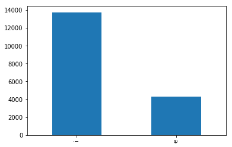

## 1. Objetivo

Desarrollar un modelo que pueda clasificar la personalidad de un usuario (mbti type) mediante análisis de texto

## 2. Planteamiento del problema 

Para construir el modelo se necesitarán textos de usuarios y sus respectivos mbti para plantear un problema de tipo aprendizaje supervisado (clasificación concretamente). 

El MBTI consta de 4 dimensiones de personalidad:

>  Introversion (I) – Extroversion (E)

>  Intuition (N) – Sensing (S)

>  Thinking (T) – Feeling (F)

>  Judging (J) – Perceiving (P)

Por lo que puede ser planteado de 3 formas distintas: 

- Clasificación binaria: Tratar de predecir cada dimension por separado (4 modelos). 

  Ej: [1,0]

- Clasificación multiclase: Tomando todas las combinaciones posibles (16 tipos) 

  Ej: [0,0,0,0,0,0,1,0,0,0,0,0,0,0,0,0]

- Clasificación multilabel: Único modelo para predecir 4 dimensiones por separado (4 outputs)

  Ej [1,1,1,0]

## 4. Metodología 

 Se ha tratado de construir un modelo para el inglés y otro para el español mediante 3 bases de datos extraidas de distintas fuentes (Forum of PersonalityCafe, Reddit y Twitter). 

### Limitaciones e inconvenientes con el modelo y los datos:

- The MBTI model (Myers-Briggs) : El modelo de personalidad mbti es bastante antiguo, su desarrollo comenzó en 1917. 

  La psicología científica todavía no estaba bien consolidada en aquella época donde la mayor parte de ésta poseía una base en el psicoanálisis. El modelo ha sido [duramente criticado](https://journals.sagepub.com/doi/abs/10.3102/00346543063004467) por la comunidad científica y actualmente no es respaldado (El modelo de personalidad predominante actual es el Big Five ).  No obstante pese a todo lo dicho, en la población de habla inglesa el MBTI se encuentra mucho mas difundido y apreciado que el Big Five, por lo que es realmente dificil (Si no, imposible) conseguir textos de un gran volumen de personas y si respectivo indicador de BigFive, por lo que para poder desarrollar este proyecto se ha tenido que utilizar el MBTI por la disponibilidad de datos, aunque debe de tenerse en cuenta las limitaciones del propio modelo como tal. 

- Idiosincracia de los datos: A excepción de PersonalityCafe forum donde se conoce con exactitud que el mbti de dichos usuarios corresponde al real, los datos extraidos tanto de Twitter como de Reddit son "self-reporting", es decir, son los propios usuarios quienes dicen cual es su MBTI type y se da por hecho que "ese es el real", más allá de la falta de veracidad del reporte, no se poseen datos sobre la fuente de extracción del mismo, si realizaron algún "test por internet" o realmente fueron evaluados por un profesional (improbable).  

  Otro aspecto a tener en cuenta es que la personalidad es considerada una dimension, esto significa que es erroneo decir que por ejemplo una persona es extrovertida o introvertida, lo correcto sería decir que esa persona es un "64%" extrovertida, pues se es más o menos, pero no se "es". Los datos usados para entrenar el modelo simplemente marcan las etiquetas como "extrovertido" o "introvertido", lo cual supone una alta pérdida de información, esto significa que se  puede estar tratando a una persona con 51% como extrovertida y 49% como introvertida sin ir más allá. 

  Por último cabe mencionar el alto desbalance de los datos, para los 16 tipos de personalidad:

  Y para cada dimensión, encontrandose el mayor desbalance entre introversión y extraversión, siendo el primer tipo mas de 3 veces más grande que el primero (3,11 aprox):

Si se juntan todas las limitaciones, se puede  imaginar algo como lo siguiente: 

*Supongamos que queremos crear un clasificador de imagenes de perros/gatos/monos.  Para ello le pasamos al modelo 700 imagenes de perros, 200 de gatos y 100 de monos para entrenarlo...aunque realmente de las 700 imagenes de perros 100 son de gatos mal clasificadas, de los monos 20 son imagenes de gatos: **Vamos a entrenar un modelo con poca muestra y asumiendo que una gran parte de la muestra puede estar mal clasificada.** 

Todas estas limitaciones, tanto por separado como juntas suponen razones suficientes como para invalidar cualquier investigación científica seria utilizando los datos recolectados, por lo que **la finalidad de este proyecto es puramente académico y de autoaprendizaje.**

### 1.  Recolección de datos
> En el presente repositorio se comparte el código utilizado pero no las bases de datos ni los diccionarios de LIWC (Bien porque no estoy autorizado a compartirlo o porque no son de dominio público)
- Datos en Inglés: 

  -Reddit: Los datos en inglés fueron solicitados al Dr. Matej Gjurković y su equipo de la Universidad de Zagreb, referentes al paper  [Reddit: A Gold Mine for Personality Prediction](https://www.researchgate.net/publication/325445581_Reddit_A_Gold_Mine_for_Personality_Prediction). Donde se recoge la personalidad de 13 mil usuarios de Reddit quienes mostraron su personalidad en posts públicamente para posteriormente hacer un scrappling de dichos usuarios y recolectar sus posts. 

  ***Los datos pueden solicitarse en: https://psy.takelab.fer.hr/

  -PersonalityCafe: El  [foro de PersonalityCafe](https://www.personalitycafe.com/) va dirigido a aficionados al modelo MBTI de personalidad, a compartir y discutir sus semejanzas y diferencias según a su tipo. Se extrajeron los últimos 50 posts de 8600 usuarios del foro. 

  El dataset se puede encontrar públicamente en [kaggle](https://www.kaggle.com/datasnaek/mbti-type)

- Datos en español: Para los datos en Español se realizó un scrapping mediante los ID de usuarios de Twitter utilizando su API , los ID de usuarios y su tipo de personalidad fueron extraídos del dataset "TWISTY", referente al paper [TWISTY: a Multilingual Twitter Stylometry Corpus for Gender and Personality Profiling](https://www.aclweb.org/anthology/L16-1258.pdf).

  El dataset con ID de usuarios puede descargarse [aqui](https://www.uantwerpen.be/en/research-groups/clips/research/datasets/)

  > Dimensiones de los datos iniciales: (comentarios | autores)

  Reddit: 22.939.193 | 13.631

  PersonalityCafe: 430.000 | 8600

  Twitter:  12.995.504 | 8900

### 2. Preprocesado de datos

- English Model: 

  - Reddit: 

    Los datos de Reddit pese a tener una gran cantidad (casi 23 millones) la mayor parte de estos no resultan aptos y se requirió un filtrado pasando por las siguientes fases:

    - Eliminar comentarios repetidos; casi la mitad de los comentarios (10 millones) eran comentarios repetidos o "spam"
    - Eliminar "autores repetidos", algunos autores constaban en algunos posts con un tipo de personalidad y en otro tipo con otro (Aquí una muestra de la baja fiabilidad de los datos)
    - Eliminar comentarios con un numero de palabras superior a 40 palabras o inferior a 5. Esto debido a que la mayor parte de la muestra (más del 90%) de los comentarios se encontraban por debajo de las 50 palabras, además se filtró hasta 40 para poder compararlo con el dataset de PersonalityCafe donde la mayoría de comentarios tenían ésta longitud maxima, también teniendo en cuenta que la mayoría de tweets (con los que se utilizará la app) rara vez sobrepasan esta longitud.
    - Codificar menciones de personalidad, dado que la muesta es extraida de "self-reported" muchos usuarios menciona su personalidad en algun post, por lo que cualquier mención de personalidad a algún tipo del mbti  ha sido codificada como "typemention". 
    - Juntar datos por usuario, se recogieron al azar 50 comentarios y se agruparon, todo esto para obtener un dataset lo mas similar al de PersonalityCafe y poder concatenar los dos. 
    - El dataset en su resultado final tenía las dimensiones de 469.850 comentarios de 9347 autores

  - PersonalityCafe:
    
    - Dado que se toma como dataset de referiencia no se requirió un alto procesamiento, solo se codificarón las menciones de personalidad como "typemention". 

  Una vez preparados los dos datasets se juntaron en un único data y se le aplicó un procesamiento básico de texto:

  - Aplicar un lower (todas las palabras en minisculas)
  - Eliminar carácteres de puntuación no alfabéticos como:   ^)#%;´{
  - Quitar espacios en blanco 
  - Construir un tokenizador (diccionario con palabras presentes) y filtrar embeddings pre-entrandos de glove (300 dimensiones)

  Es importante señalar qué sin el procesamiento mencionado, los resultados de entrenamiento en el modelo son hasta un 30% mejores, alcanzandose un accuracy de casi el 90% en algunas dimensiones. No obstante cabe recalcar que dicho modelo haría "trampas" puesto que aprendería a identificar el propio tipo mencionado por un usuario como su personalidad o identificar patrones de spam realizados por el mismo usuario. 

- Spanish Model: Para el modelo en Español se juntaron los tweets de usuarios y se filtraron los usuarios de los que se pudo extraer al menos 500 Tweets. El preprocesado de texto fue igual que con el dataset en inglés a excepción de no eliminar las palabras con acento y la "ñ".

También se realizaron pruebas aplicando un preprocesado con métodos con lemmatizacion or stemming, pero sin mejoras.

### 3. Entrenamiento

Se probaron distintos tipos de modelos, a mencionar:

- Para la codificación: Bag of Words (CountVectorizer), TF-IDF Vectorizer, Embeddings Preentrenados, Embeddings Aprendidos, LIWC vectors, estadísticos del texto (n_words, n_unique_words, verbs, nouns...)
- Para entrenar el modelo: Regresión Logística, SVM, Random Forest, XGBoost, Light Gradient Boost (LGBM), redes con capas densas totalmente conectadas, capas recurrentes (LSTM), de convolución 1D y 2D.

> **¿Qué son los LIWC vectors?** No es mas que un diccionario con más de diez mil palabras agrupadas en categorías semánticas, como por ejemplo: Guerra, Amor, Familia, Animales etc (63-73 categorías en total). Así por ejemplo con la frase "Me gustan los perros y los gatos", se obtendría en la categoría de animales un 2, un 1 en la categoría de afiliación otro 1 en positivo etc.", en resumen, la salida sería un OneHotEncoding con las categorías semánticas. 
>
> Se puede encontrar un aproximación similar y gratuita con la libreria [EMPATH](https://github.com/Ejhfast/empath-client)

Para la codificación el bag of words dió mejores resultados que el TF-IDF, los vectores LIWC se quedaron muy cerca, los embeddings preentrenados dieron resultados similares a los entrenados y los estadísticos de texto no superaron ni siquiera la linea base del 50%.

De todos los modelos probados (SVM, LOGREG, Random Forest and XGBoost) el LGBM dio los mejores resultados y con un entrenamiento hasta 10 veces más rápido que el resto. 

**El mejor modelo, con mejor AUC y más rápido fue el LGBM con un CountVectorizer y ngrams (1,3) con max_features=5000**

En cuanto a las redes, se desechó el uso de capas LSTM por ser demasiado lentas y no aportar mejoras a las capas de convolución, las capas densas tampoco lo hicieron. El mejor auc se obtuvo con un modelo de convolución con branches como el propuesto por Yoon Kim [paper](https://www.aclweb.org/anthology/D14-1181.pdf) aunque para poder aplicarlo se siguieron dos estrategias: 

1. Separar nuevamente los comentarios de cada autor para pasar a la red un comentario como ejemplo de entrenamiento (pasando un max_len de 50 para los embeddings y entrenar con 430 mil samples) o pasar directamente los comentarios agrupados (con un max_len=1500 y entrenar con 18 mil samples). 

   En el primer caso al tener muchos samples para entrenar la red era estable pero debido al desbalance de los datos tendía a sobreajustar y clasificar a todos los comentarios como "infj" (con 16 salidas) o a todos como introvertidos (con una salida), para corregir esto se probaron dos procedimientos, el primero pasar el mismo numero de types of personality (balanceado) y el segundo o bien pasar pesos ponderados para cada clase en un diccionario (class_weights) o pasar ponderaciones para cada muestra (sample_weights) para corregir la función de pérdida. En el primero caso no se superó el 50% y en el segundo la red era muy lenta y apenas llegaba al 55% (con el mismo procedimiento LGBM conseguía un 56%).

2. Pasar directamente los comentarios agrupados: Se disponía de muy pocos samples (18 mil ) para alimentar una red, y debido a lo desbalanceado que estaba, no resultaba estable, se procuró hacer un stratify k fold, pero la desviación era demasiado alta y en cualquier caso apenas conseguía alcanzar al LGBM model, y esto hablando del accuracy, con un roc_auc no superaba el 51% por lo que fue desechado completamente.

En conjunto ninguna red pudo vencer al modelo base LGBM con n-grams mencionado que obtuvo los mejores y más rápidos resultados: 

| roc_auc_score mean | E-I          | S-N          | T-F          | J-P          |
| :----------------: | ------------ | ------------ | ------------ | ------------ |
|        CV13        | **0.662692** | 0.656516     | **0.791028** | **0.640405** |
|        TF13        | 0.656171     | **0.656572** | 0.788312     | 0.635755     |
|        LIWC        | 0.630212     | 0.606550     | 0.750429     | 0.587492     |

***CV13 = CountVectorizer (1,3) n-grams, TF13 = TF-IDF (1,3) n-grams***

Cabe destacar la cercanía de los vectores LIWC que ofrecen un rendimiento similar pese a ser solo 63 categorías, lo cual lo convertiría en un modelo con una gran relación accuracy/velocidad 

>  En el repositorio se encuentra el código necesario para replicar los resultados del mejor modelo (aunque no se comparte la base de datos de Reddit). 
>
> Debido al alto numero de variables de modelos de redes (docenas de combinaciones), se comparten solo los de la red de convolución con embeddings preentrenados, que fue la que mejor resultados dió, pero sin llegar a superar al modelo LGBM (como máximo llegando a un 0.55)

Para el modelo en Español se replicaron los mismos procedimientos que en el Modelo en Inglés, nuevamente los resultados son prácticamente iguales, el mejor   fue el LGBM con n-gramas, con los siguientes resultados de un stratified K Fold con 5 splits:

| roc_auc_score mean | E-I          | S-N          | T-F          | J-P          |
| -----------------: | ------------ | :----------- | :----------- | :----------- |
|               CV13 | 0.647423     | **0.601979** | 0.613047     | **0.584833** |
|               TF13 | **0.651896** | 0.593516     | **0.617540** | 0.583497     |
|               LIWC | 0.622816     | 0.579548     | 0.601328     | 0.562347     |

***CV13 = CountVectorizer (1,3) n-grams, TF13 = TF-IDF (1,3) n-grams***

## 4. FRONT END 

Para subir el modelo final se utilizó streamlit.

Se creó un repositorio privado donde poder conectarlo a la API de Twitter (claves personales) y a los diccionarios de LIWC (pues no pueden hacerse públicos), además la app fue subida con heroku para poder acceder desde cualquier dispositivo. Solo se subió el modelo en inglés pues el modelo en español apenas llegaba al 60%; con un poder estadístico del 10% el modelo apenas vence al azar. 

## Conclusiones

Debido a la  falta de validez de los datos y la escasez de los mismos no ha sido posible desarrollar modelos más avanzados de tipo DeepLearning, debido a: 

1. No se pueden tomar los posts por usuario y separarlos puesto que los samples al ser de mismos autores guardan características en el estilo de escritura y lenguaje; la red termina aprendiendo antes estos estilos que la personalidad del autor, como muletillas, frases hechas, spam etc. 
2. Al no poder separarse los posts, queda muy poca muestra (18 mil) para poder entrenarlo con una red realizando sus convenientes splits (train/val/test), haciendo que la red sea inestable sin clarificar cuantos epochs necesita; La red tiende a sobrentrenarse o no aprender en absoluto con poca muestra. Al probarlo con k-folds y un numero limitado de epochs (entre 5 y 20) la desviación para cada predicción en cada k-fold alcanza el 20% (Ej: 55% en un kfold y 75% en otro), algo inviable. 
3. Al tener poca muestra (los mencionados 18 mil) no es conveniente realizar una clasificación de tipo multiclase, pues tratar de aprender 16 categorías distintas resulta inviable para cualquier tipo de modelo, ya sea uno simple basado en bolsas de palabras o de DeepLearning. El estar la variable criterio tan inbalanceada se traduce en que quedan menos de 200 samples para algunos niveles de la variable y más de 2000 para otras. 
4.  El mejor abordamiento y con mejores resultados es entrenar un modelo para cada clase, esto ayuda a compensar el desbalance: De 1/10 para algunas clases a como mucho 1/3.

En conclusión, debido a las limitaciones encontradas principalmente por la tipología de los datos para el problema planteado el mejor acercamiento ha resultado en un simple bolsa de palabras con n-gramas aunque cabe destacar la cercanía de los vectores de LIWC, que siendo tan pocos (63) y obteniendose de forma rápida, obtienen unos resultados similares a los n-gramas.

En cualquier caso ha sido un proyecto interesante que permite introducirse en todo tipo tipo de campos dentro del NLP, desde las bolsas de palabras a embeddings, diccionarios semánticos (como LIWC o EMPATH) o el uso de modelos de red tipo multientrada/multisalida  y/con distintas ramas. 

